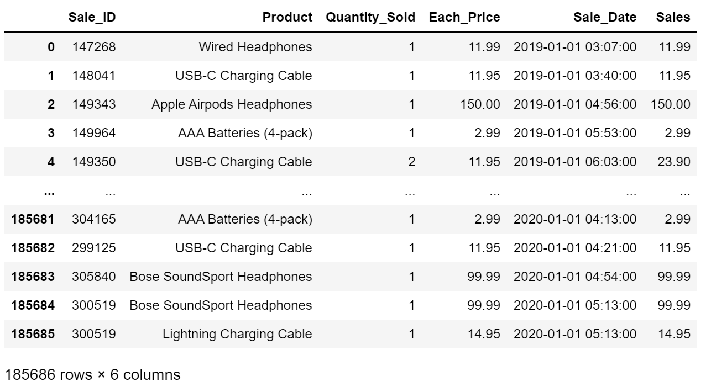
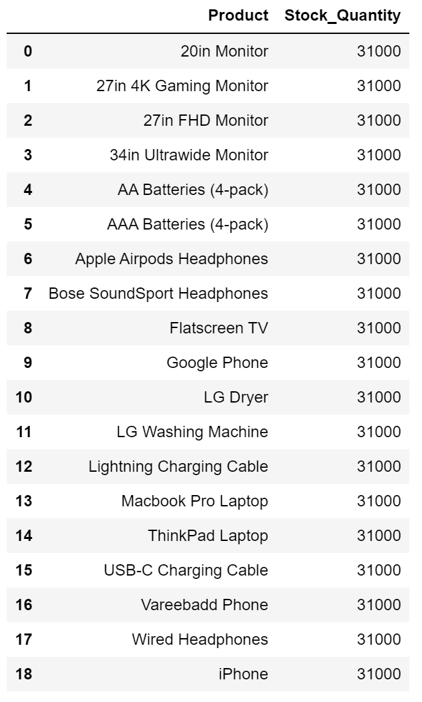

# Real-Time-Sales-Data-Analysis-Application
A real-time sales data analysis Application using Spark Structured Streaming, Kafka as a messaging system, PostgreSQL as a storage for processed data, and Superset for creating a dashboard.

## Project Description
Mya Gon Yaung is a men's traditional clothing retail shop that manually records everything in a book. Since sales are only written in a book, it is easy to find daily sales but difficult to know monthly or yearly sales. As a result, the shop owners do not know their monthly and yearly sales, what products are sold most in which month, and which stocks need to be refilled and which don't. As they don't know the answers to these questions, they often overstock or understock many products which greatly affects their profits.

This project is used to find out whether having a real-time sales data analysis application will be a solution to solve the problems faced at Mya Gon Yaung.

## Data Platform Architecture

**Overview:**
- Customer purchase data flows to Kafka producer.
- Kafka sends data to a designated topic.
- Apache Spark processes data in real-time.

**Data Ingestion:**
- Customer purchase information is generated at the checkout counter.
- The data is sent to a Kafka producer.
- Kafka producer transmits the data to a specific Kafka topic in the messaging layer.

**Stream Processing:**
- Apache Spark streaming application ingests and processes data from the Kafka topic.
- Processing includes extracting relevant information and transforming data for further analysis.

**Data Storage:**
- Processed data is stored in a PostgreSQL database.
- PostgreSQL provides a reliable and structured storage solution for the processed data.

**Real-Time Analytics:**
- The stored data in PostgreSQL is used to build live dashboards using Apache Superset.
- Apache Superset enables real-time analytics and visualization of key metrics derived from the processed data.

This architecture ensures a seamless flow of data from its generation at the checkout counter to real-time analytics and visualization, enhancing the overall efficiency of the data platform.

## Project Workflow

### Data Source

To simulate product checkout, I utilized a Kaggle [sales dataset](https://www.kaggle.com/datasets/knightbearr/sales-product-data) in the Kafka Producer.

### Data Preparation

The Kaggle dataset required cleaning and column trimming.
**Sample of Sales Data:**

**Stock Quantity Data:**

### Data Producer

Implemented a Kafka Producer to stream sales data to the "sales" topic in Kafka.

### Data Storage

Developed a Python script to create a PostgreSQL database and tables for storing processed data.

### Spark Structure Streaming

Created a Python script for ingesting, processing, and storing data from the "sales_topic" Kafka topic into PostgreSQL.

- Stream data from Kafka using Spark.
- Store raw sales data in MongoDB.
- Transform data by splitting "Sale_Date" into "Date," "Day," "Month," and "Year."
- Store transformed sales data in MySQL.
- Join with Stock Quantity data, aggregate, and store in MySQL.

For a detailed understanding, refer to the [structure_streaming.py](Codes/structure_streaming.py) code.

